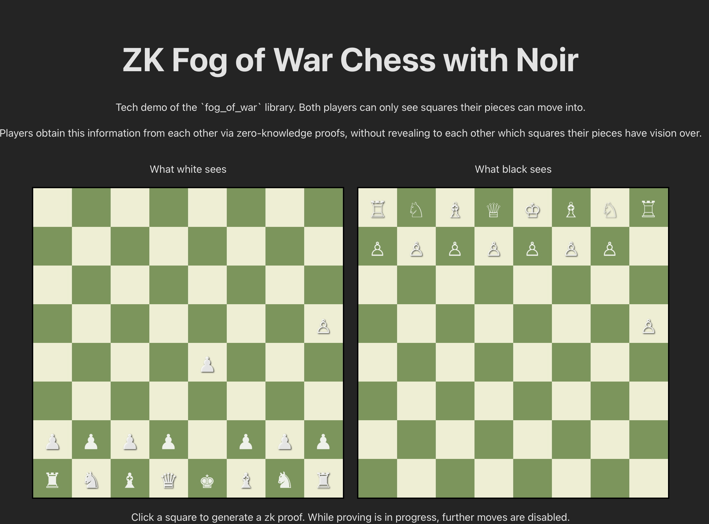

# Fog of war chess, tech demo

This app implements a side-by-side view of two chessboards playing fog-of-war chess, where players confidentially transfer hidden information to each other via zk proofs generated with Noir.
In fog-of-war chess, players can only view squares that their pieces can move into. The goal is not checkmate, but instead to capture the king.

# Setup

Library requires bun to run. Library uses Noir version 1.0.0-beta.3 . To install bun:

```
curl -fsSL https://bun.sh/install | bash
```

Once bun is installed, run `bun i`, then `bun run dev` . The page should be hosted on `localhost:5173.`


